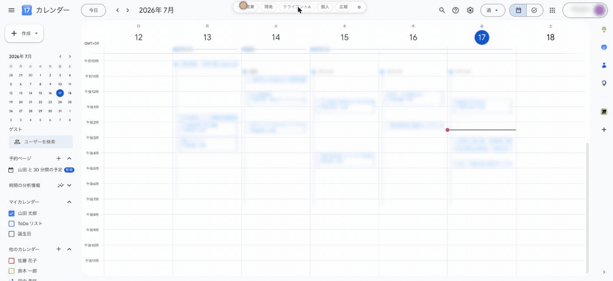
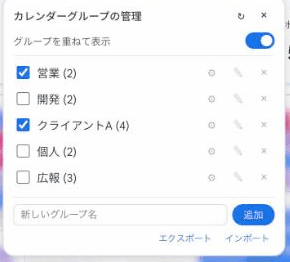
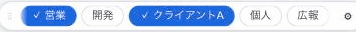
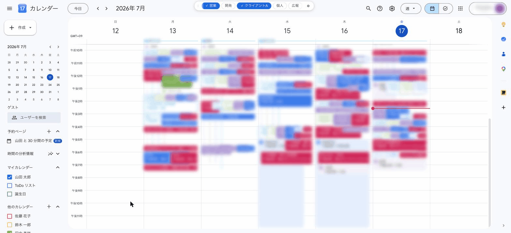
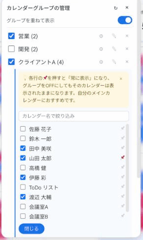

# Google Calendar グループ切替

Googleカレンダーのカレンダーを「チーム」「案件」などのグループにまとめて、ワンクリックで表示を切り替えられるChrome拡張です。

> 📷 掲載しているキャプチャは、プライバシー保護のため予定をぼかし、カレンダー名・グループ名をダミーに置き換えています。

## こんなときに

- 朝いちばんに「自分の予定だけ」の状態へ戻したい
- 会議調整のときだけ、チームメンバー全員のカレンダーを重ねたい
- 会議室や共有カレンダーは、必要なときだけ表示したい

サイドバーのチェックボックスを1つずつ切り替える代わりに、画面上部のチップを1回クリックするだけになります。

## インストール

### 利用者向け(おすすめ): リリースzipから

1. [Releases](https://github.com/Ptaka/gcal-groups/releases) から最新の `gcal-groups-vX.Y.Z.zip` をダウンロードします
2. zipを展開し、できた `gcal-groups` フォルダを**今後動かさない場所**に置きます(例: `~/書類/chrome-extensions/gcal-groups`)
3. Chromeで `chrome://extensions` を開きます
4. 右上の「デベロッパー モード」をオンにします
5. 「パッケージ化されていない拡張機能を読み込む」をクリックし、手順2のフォルダを選択します
6. `calendar.google.com` を開きます(すでに開いていたらリロード)

画面上部の中央にチップバーが表示されたら準備完了です。

#### 更新するとき

1. 新しいzipを展開し、中身のファイルを**前回と同じフォルダに上書きコピー**します
2. `chrome://extensions` で拡張の ↻(再読み込み)をクリックします

> ⚠️ **フォルダの場所を変えないでください。** 別のフォルダから読み込み直すと、Chromeからは別の拡張として扱われ、作成済みのグループが見えなくなります(データは消えませんが、元のフォルダで読み込んだ拡張に紐づいたままになります)。念のため ⚙ → エクスポート で定期的にバックアップしておくと安心です。

### 開発者向け: リポジトリから

1. このリポジトリをcloneします
2. 上記の手順3〜6と同様に、cloneしたフォルダを読み込みます

## はじめる — 最初のグループを作る

1. チップバー右端の **⚙** をクリックして「カレンダーグループの管理」を開きます
2. 下部の入力欄にグループ名(例: `開発チーム`)を入力して「追加」をクリックします
3. 追加したグループの **⚙** をクリックし、入れたいカレンダーにチェックを付けます
4. 「閉じる」で完了。バーに新しいチップが並びます

グループがまだ1つもないときは、バーに「＋ グループを作成」チップが表示されるので、そこからも始められます。

 

## 毎日の使いかた

### チップをクリックして、まとめて表示ON/OFF

チップの色が、いまの表示状態を表します。

| 見た目 | 状態 |
|---|---|
| 青塗り | グループの全カレンダーを表示中 |
| 淡い青 | 一部のカレンダーだけ表示中 |
| 白(枠のみ) | すべて非表示 |
| グレー | 対象のカレンダーが見つからない |

### 「1グループずつ」と「重ねて表示」を使い分ける

管理パネル上部の「グループを重ねて表示」トグルで切り替えます。

- **オン(標準)**: 複数のグループを同時に重ねて表示できます。空き時間探しに便利です
- **オフ**: チップをクリックすると他のグループは自動でオフになります。「いま見たい1グループ」に集中できます

### いつも見たいカレンダーはピン留め

グループの **⚙**(メンバー編集)で、カレンダー名の右の **📌** をクリックします。

ピン留めしたカレンダーは、グループをオフにしても表示されたままになります。自分のカレンダーへのピン留めがおすすめです。

カレンダーが多いときは、上部の入力欄で名前の絞り込みができます。

 

### バーを好きな位置へ

バー左端の **⋮⋮** をドラッグすると移動できます。位置は記憶されます。

### グループをチームで共有する・バックアップする

管理パネル下部の「エクスポート」で、全グループとピン留めをJSONファイルとして保存できます。受け取った側は「インポート」でファイルを選ぶだけです。

- インポートは**追加マージ**です: 手元のグループはそのまま残り、同じ名前のグループだけメンバーが上書きされます
- カレンダーは「表示名」で共有されます。相手がそのカレンダーを購読していない場合、購読するまでチップはグレー(対象なし)や淡い青(一部)の表示になります
- エクスポートしたファイルにはカレンダー名(メンバーの名前など)が含まれます。チーム外への共有にはご注意ください

## こんなときは

**新しいカレンダーが候補に出てこない**
→ 管理パネルの **↻**(再スキャン)をクリックしてください。サイドバーを自動スクロールして、画面外のカレンダーも含めて検出し直します。

**カレンダーの名前を変えたら、グループが効かなくなった**
→ この拡張はカレンダーを「名前」で識別します。⚙ から新しい名前のカレンダーをグループに入れ直してください。

**チップがグレーのまま/クリックしても変わらない**
→ サイドバー(マイカレンダーの一覧)が非表示だと切り替えできません。カレンダー左上の ≡ でサイドバーを表示してください。

**設定はどこに保存される?**
→ `chrome.storage.sync` に保存され、同じGoogleアカウントでログインしたChrome間で自動同期されます。

## 仕組み(技術メモ)

- GoogleカレンダーのDOM(Wizフレームワーク管理下)には一切要素を挿入しません。UIは `document.body` 直下の固定オーバーレイなので、GCal本体の描画を壊しません。
- カレンダーの識別はサイドバーのチェックボックスの `aria-label`(カレンダー名)です。
- セクションが折りたたまれている、またはリストが長く画面外にあるカレンダーはDOMに存在しませんが、一度検出した名前はキャッシュされ、編集時の候補に残ります。
- 表示ON/OFFは、サイドバーのネイティブなチェックボックスをプログラム的にクリックする方式です。そのためサイドバー自体が非表示だと動作しません。

## 開発

- ビルド不要の素のJS/CSSです。ファイルを編集したら `chrome://extensions` で拡張をリロードしてください。
- リリース: `manifest.json` の `version` を上げて `CHANGELOG.md` を更新し、gitタグ(`v3.15.0` 形式)をpushすると、GitHub Actionsが配布用zipを作成してReleaseに添付します(タグとmanifestのバージョンが一致しないと失敗します)。
- `docs/images/` のキャプチャはマスキング(予定のぼかし・ダミー名置換)済みのデモ用データです。
- アイコンは `icons/icon.svg` が原本です。変更したら `scripts/render-icons.sh` で PNG を再生成してください。
- Chrome Web Store 用の画像と掲載文は `store/` にあります。画像は `scripts/render-store-images.sh` で生成し、`scripts/check-store-assets.sh` で寸法などを検証できます。
